# CreativeFlow AI - System Architecture

## Overview
CreativeFlow AI is a comprehensive multi-modal AI content generation platform built with a modern microservices-inspired architecture, featuring a React frontend, FastAPI backend, and integration with multiple AI services.

## Architecture Diagram

```mermaid
graph TB
    %% User Layer
    U[👤 User] --> WB[🌐 Web Browser]
    
    %% Frontend Layer
    WB --> FE[⚛️ React Frontend<br/>TypeScript + Tailwind CSS]
    
    %% Frontend Components
    FE --> |Components| FC[🧩 UI Components<br/>• Layout (Header, Sidebar)<br/>• Forms (Login, Register)<br/>• Generators (Story, Social)<br/>• Media Players]
    FE --> |State| FS[🗂️ State Management<br/>• Zustand Store<br/>• Auth Store<br/>• Project Store]
    FE --> |Services| API[🔌 API Client<br/>• HTTP Client<br/>• Token Management<br/>• Error Handling]
    
    %% Backend Layer
    API --> |HTTPS/REST| BE[🚀 FastAPI Backend<br/>Python + SQLAlchemy]
    
    %% Backend Components
    BE --> AUTH[🔐 Authentication<br/>• JWT Tokens<br/>• Password Hashing<br/>• User Management]
    BE --> ROUTES[🛤️ API Routes<br/>• /auth - Authentication<br/>• /users - User Management<br/>• /projects - CRUD<br/>• /generate - AI Services]
    BE --> DEPS[⚙️ Dependencies<br/>• Database Sessions<br/>• Current User<br/>• Redis Client]
    
    %% Data Layer
    BE --> |SQLAlchemy ORM| DB[(🗄️ PostgreSQL<br/>• Users<br/>• Projects<br/>• Generations<br/>• Media)]
    BE --> |Redis Client| CACHE[(⚡ Redis Cache<br/>• Session Data<br/>• Generation Queue<br/>• Rate Limiting)]
    
    %% AI Services Layer
    BE --> |HTTP APIs| AI[🤖 AI Services]
    AI --> OPENAI[🧠 OpenAI<br/>• GPT-4 (Text)<br/>• DALL-E 3 (Images)<br/>• Whisper (Speech)]
    AI --> ELEVEN[🗣️ ElevenLabs<br/>• Voice Synthesis<br/>• Speech Generation]
    AI --> STABILITY[🎨 Stability AI<br/>• Image Generation<br/>• Style Transfer]
    
    %% Storage Layer
    BE --> |File Upload| STORAGE[☁️ Storage Layer]
    STORAGE --> S3[📦 AWS S3<br/>• Media Files<br/>• Generated Content<br/>• User Uploads]
    STORAGE --> LOCAL[💾 Local Storage<br/>• Development<br/>• Temporary Files]
    
    %% Infrastructure Layer
    subgraph INFRA[🏗️ Infrastructure]
        DOCKER[🐳 Docker<br/>• PostgreSQL<br/>• Redis<br/>• FastAPI<br/>• React]
        ENV[⚙️ Environment<br/>• Configuration<br/>• Secrets<br/>• API Keys]
    end
    
    %% Real-time Layer
    BE --> |WebSockets| WS[⚡ Real-time Updates<br/>• Generation Progress<br/>• Live Notifications<br/>• Status Updates]
    WS --> FE
    
    %% Background Processing
    BE --> |Celery/Background| BG[⚙️ Background Tasks<br/>• AI Generation Queue<br/>• Media Processing<br/>• Cleanup Jobs]
    BG --> CACHE
    
    %% Security Layer
    subgraph SEC[🔒 Security Layer]
        JWT[🎫 JWT Authentication]
        BCRYPT[🔐 Password Hashing]
        CORS[🌐 CORS Policy]
        RATE[⏱️ Rate Limiting]
    end
    
    AUTH --> JWT
    AUTH --> BCRYPT
    BE --> CORS
    BE --> RATE
    
    %% Styling
    classDef frontend fill:#61dafb,stroke:#333,stroke-width:2px,color:#000
    classDef backend fill:#009688,stroke:#333,stroke-width:2px,color:#fff
    classDef database fill:#336791,stroke:#333,stroke-width:2px,color:#fff
    classDef ai fill:#ff6b6b,stroke:#333,stroke-width:2px,color:#fff
    classDef infra fill:#ffc107,stroke:#333,stroke-width:2px,color:#000
    classDef security fill:#e91e63,stroke:#333,stroke-width:2px,color:#fff
    
    class FE,FC,FS,API frontend
    class BE,AUTH,ROUTES,DEPS,WS,BG backend
    class DB,CACHE database
    class AI,OPENAI,ELEVEN,STABILITY ai
    class DOCKER,ENV,STORAGE,S3,LOCAL infra
    class JWT,BCRYPT,CORS,RATE security
```

## Data Flow Architecture


## Component Architecture

### Frontend Architecture (React + TypeScript)
```
src/
├── components/          # Reusable UI components
│   ├── ui/             # Basic UI elements (Button, Input, Modal)
│   ├── layout/         # Layout components (Header, Sidebar)
│   ├── generation/     # AI generation components
│   └── media/          # Media handling components
├── pages/              # Route components
├── services/           # API and external service clients
├── store/              # State management (Zustand)
├── hooks/              # Custom React hooks
└── types/              # TypeScript type definitions
```

### Backend Architecture (FastAPI + Python)
```
app/
├── api/v1/             # API route definitions
│   └── endpoints/      # Individual endpoint modules
├── core/               # Core functionality
│   ├── database.py     # Database configuration
│   ├── security.py     # Authentication & security
│   └── redis.py        # Cache configuration
├── models/             # SQLAlchemy database models
├── schemas/            # Pydantic request/response models
├── services/           # Business logic layer
│   ├── ai/            # AI service integrations
│   └── user_service.py # User management logic
└── workers/            # Background task workers
```

## Database Schema


## Security Architecture

### Authentication & Authorization
- **JWT (JSON Web Tokens)** for stateless authentication
- **BCrypt** password hashing with salt
- **Bearer Token** authentication scheme
- **Role-based access control** (planned)
- **Rate limiting** on authentication endpoints

### Data Protection
- **HTTPS** encryption for all communications
- **Environment variables** for sensitive configuration
- **Database connection pooling** with SSL
- **CORS policy** for cross-origin requests
- **Input validation** with Pydantic schemas

## Deployment Architecture

```mermaid
graph LR
    subgraph DEV[🛠️ Development]
        DC[🐳 Docker Compose<br/>• PostgreSQL<br/>• Redis<br/>• FastAPI<br/>• React]
        LOCAL[💻 Local Development<br/>• Hot Reload<br/>• Debug Mode<br/>• Local Storage]
    end
    
    subgraph PROD[🚀 Production]
        LB[⚖️ Load Balancer]
        APP[📱 Application Servers<br/>• FastAPI Instances<br/>• Gunicorn/Uvicorn]
        DB[🗄️ Database Cluster<br/>• PostgreSQL Primary<br/>• Read Replicas]
        REDIS[⚡ Redis Cluster<br/>• Cache<br/>• Session Store]
        CDN[🌐 CDN<br/>• Static Assets<br/>• Media Files]
        S3[☁️ AWS S3<br/>• File Storage<br/>• Backups]
    end
    
    LB --> APP
    APP --> DB
    APP --> REDIS
    APP --> S3
    CDN --> S3
```



## Technology Stack Summary

| Layer | Technology | Purpose |
|-------|------------|---------|
| **Frontend** | React 18 + TypeScript | User interface and client-side logic |
| **Styling** | Tailwind CSS + Framer Motion | Responsive design and animations |
| **State Management** | Zustand | Client-side state management |
| **Backend** | FastAPI + Python 3.11 | REST API and business logic |
| **Database** | PostgreSQL 15 | Primary data storage |
| **Cache** | Redis 7 | Session storage and caching |
| **ORM** | SQLAlchemy 2.0 | Database abstraction layer |
| **Authentication** | JWT + BCrypt | Secure user authentication |
| **AI Services** | OpenAI, ElevenLabs, Stability AI | Content generation |
| **Storage** | AWS S3 | File and media storage |
| **Containerization** | Docker + Docker Compose | Development and deployment |
| **Migration** | Alembic | Database schema versioning |

## Performance Considerations

### Frontend Optimization
- **Code splitting** for reduced initial bundle size
- **Lazy loading** for routes and components
- **Memoization** for expensive computations
- **Virtual scrolling** for large lists
- **Image optimization** and lazy loading

### Backend Optimization
- **Connection pooling** for database efficiency
- **Redis caching** for frequently accessed data
- **Background tasks** for long-running operations
- **Rate limiting** to prevent abuse
- **Database indexing** for query optimization

### Scalability Features
- **Horizontal scaling** ready architecture
- **Stateless backend** design
- **External file storage** (S3)
- **Caching layers** at multiple levels
- **Async processing** for AI generations

This architecture provides a solid foundation for a production-ready AI content generation platform with room for future scaling and feature expansion.